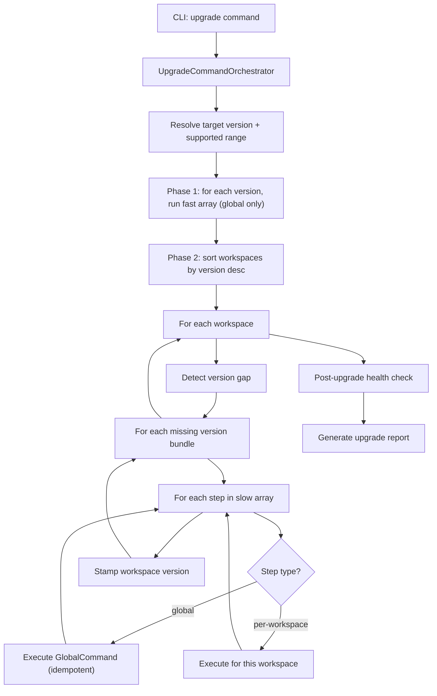
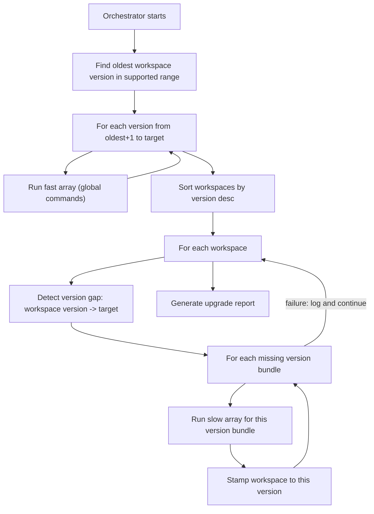
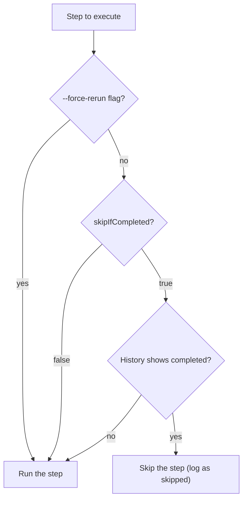

# Upgrade Experience V2 -- Design Document

## Problem Statement

The current upgrade system has several pain points:

- **No cross-version upgrade**: a workspace must be on exactly the previous minor version to upgrade. Skipping versions requires stepping through each intermediate release.
- **Opaque errors**: failures surface as raw stack traces with no structured reporting or actionable diagnostics.
- **Misleading abstractions**: the command runner inheritance chain (`MigrationCommandRunner` -> `WorkspacesMigrationCommandRunner` -> `ActiveOrSuspendedWorkspacesMigrationCommandRunner` -> `UpgradeCommandRunner`) conflates global operations with per-workspace operations under a single hierarchy.
- **No post-upgrade health check**: after upgrade, there is no validation that the workspace is in a consistent state.
- **No workspace status visibility**: end users (self-hosted admins) have no way to see their workspace version or whether it is out of date.

## Success Metrics

- **Cross-version upgrade** works across the ordered list of supported versions (a workspace on `1.18.0` targeting `1.20.0` runs `1.19.0` then `1.20.0` steps sequentially).
- **Patch-version upgrade support**: the upgrade triggers on patch version differences, not just major.minor. Currently `compareVersionMajorAndMinor` ignores patches entirely, meaning a workspace on `1.20.0` is considered "equal" to `1.20.1` and patch-level upgrade steps cannot run.
- **Post-upgrade health check** validates workspace consistency after migration.
- **Improved developer experience** for twenty-eng: clear command taxonomy, scoped responsibilities, easy to add new version bundles and steps.
- **Report-a-problem template** that gathers workspace status including upgrade stack traces.
- **Settings page** (follow-up) shows current workspace version; if it differs from the installed server version, prompts the user to contact their administrator.

---

## Core Principles

- **Idempotency**: all upgrade commands -- both `GlobalCommand` and `PerWorkspaceCommand` -- must be idempotent. Running the same command twice on the same workspace (or the same global state) produces the same result as running it once. This is critical because global commands affect the shared database and may run before all workspaces are upgraded, and single-workspace upgrades re-run global commands that may have already been applied.
- **Forward compatibility of global changes**: global commands (especially `fast` ones like TypeORM migrations) must produce a schema that is compatible with workspaces still on older versions. A global schema change that breaks older workspaces violates the cross-version upgrade contract.
- **No downgrade support**: the upgrade path is forward-only.

---

## Command Taxonomy

Replace the current deep inheritance chain with two explicit base classes and an orchestrator.

### Base Command Types

- **GlobalCommand**: Runs once, globally, workspace-agnostic. Example: running pending TypeORM core migrations (`transaction: 'each'`), applying a breaking schema change.
- **PerWorkspaceCommand**: Iterates over all active/suspended workspaces and executes per-workspace logic. Example: backfilling data, migrating workspace schemas.

### Step Contract

Every step (both `GlobalCommand` and `PerWorkspaceCommand`) must follow a strict contract:

**Return type -- discriminated union**:

```typescript
type UpgradeStepResult =
  | { status: 'success' }
  | { status: 'failure'; error: string };
```

- Steps must **never throw**. They return `{ status: 'failure', error }` instead.
- The orchestrator wraps each step execution in a try/catch to handle unexpected exceptions -- these are converted into a `failure` result with the caught error message and stack.

**Log capture**:

Steps use the standard NestJS `Logger` (`this.logger`) -- no custom callback or API change. The orchestrator intercepts log output at two levels:

**Step logger -- signal** (full capture, tail-truncated):
- The orchestrator wraps the step's own `Logger` instance to tee its output into a per-step buffer, in addition to normal stdout behavior.
- This captures the step's own narrative: progress, warnings, decisions. No change needed in step code.
- Tail-truncated to last 5,000 lines if exceeded. A `[TRUNCATED]` header is prepended when truncation occurs.
- On **failure**: the buffer is stored in the `stepLogs` column of the `workspace_upgrade_history` table.
- On **success**: the buffer is discarded (already written to stdout).

**Global NestJS logger -- noise/context** (rolling buffer):
- During each step execution, the orchestrator captures a rolling buffer of the last 500 lines from the global NestJS `LoggerService`, all log levels. This includes ORM queries, SQL errors, service-level logs, and framework context from other services the step calls.
- A `[TRUNCATED]` header is prepended when the buffer wraps.
- On **failure**: the buffer is stored in the `serverLogs` column of the history table.
- On **success**: the buffer is discarded.

The two columns are a **signal-to-noise separation**: `stepLogs` is the clean story of what the step was doing; `serverLogs` is the system-level context underneath. Debuggers read `stepLogs` first, then `serverLogs` only if they need to dig deeper.

**Orchestrator error handling**:

```typescript
let result: UpgradeStepResult;

try {
  result = await step.command.execute(context);
} catch (unexpectedError) {
  result = {
    status: 'failure',
    error: `${unexpectedError.message}\n${unexpectedError.stack}`,
  };
}
```

### Version Bundles and Steps

**Terminology**:

- A **version bundle** is the per-version `{ fast, slow }` object (e.g. `steps_1200`). It groups all commands needed to upgrade workspaces *to* that version.
- A **step** is an individual entry within a `fast` or `slow` array -- a single `{ type, command }` pair.

Each version defines its upgrade bundle as two ordered arrays:

- **`fast`**: Commands that must execute quickly (e.g. breaking schema changes, TypeORM migrations). Contains **only `GlobalCommand` entries**. These run first.
- **`slow`**: Commands that may take longer (backfills, data migrations). Contains an **interleaved mix of `GlobalCommand` and `PerWorkspaceCommand` entries**. These run after `fast` completes.

```typescript
const steps_1200: VersionUpgradeSteps = {
  fast: [
    { type: 'global', command: this.typeOrmMigrationCommand },
  ],
  slow: [
    { type: 'per-workspace', command: this.backfillCommandMenuItemsCommand },
    { type: 'per-workspace', command: this.migrateRichTextToTextCommand },
    { type: 'global', command: this.someGlobalCleanupCommand },
    { type: 'per-workspace', command: this.backfillSelectFieldOptionIdsCommand },
  ],
};
```

### Orchestrator

`UpgradeCommandOrchestrator` (renamed from `UpgradeCommand`) is responsible for:

1. Resolving the current app version and the supported upgrade range.
2. Determining which version bundles to run based on the workspace's current version.
3. **Phase 1**: run `fast` arrays (global-only) for all intermediate version bundles up to the target.
4. **Phase 2**: for each workspace (sorted by version desc), walk through missing version bundles running each `slow` array as-is (global + per-workspace steps interleaved).

### Diagram



---

## Cross-Version Upgrade

### How It Works

`UPGRADE_COMMAND_SUPPORTED_VERSIONS` remains an ordered list of versions (e.g. `['1.18.0', '1.19.0', '1.20.0']`). The orchestrator uses it as a timeline:

1. Read the workspace's current version.
2. Find that version in the ordered list.
3. Run all version bundles from the next entry up to (and including) the current app version, sequentially.

No per-version allowlist is needed. The ordered list itself defines the upgrade path. The oldest entry in the list is the oldest supported source version -- anything below it is out of range.

### Key Principle: Rescue Stragglers Within the Supported Range

The cross-version upgrade attempts to bring **all** workspaces within the supported range up to the target version -- not just workspaces that were on the previously installed version. If a workspace was already behind before this deploy (e.g. it failed a previous upgrade), the orchestrator still attempts to walk it through all intermediate version bundles.

This means the `1.20.0` codebase must ship all version bundles back to the oldest supported version. If `UPGRADE_COMMAND_SUPPORTED_VERSIONS` is `['1.17.0', '1.18.0', '1.19.0', '1.20.0']`, then the `1.20.0` release includes `steps_1180`, `steps_1190`, and `steps_1200`.

Workspaces below the oldest supported version (e.g. `1.16.0` when the oldest is `1.17.0`) are out of range and handled by the guard/force logic.

### Execution Flow

The upgrade runs in two phases:

**Phase 1 -- Fast commands (global, all intermediate versions)**:

The orchestrator runs the `fast` array for **every version from the oldest needed up to the target**, in order. Since fast commands are global and affect the shared database, they must all run to bring the core schema to the target state. TypeORM migrations are naturally incremental (pending migrations run in timestamp order), but non-TypeORM global commands in `fast` also need to execute for each intermediate version.

**If any fast command fails, the upgrade aborts immediately** -- Phase 2 does not start. There is no rollback of previously completed fast commands; each command runs in its own transaction, so only the failing command's transaction is not applied. Previously completed commands remain in effect. The operator must fix the issue and re-run the upgrade (idempotency ensures already-completed commands no-op).

**Phase 2 -- Slow commands (per-workspace, sorted by version desc)**:

Workspaces are sorted by version descending (most up-to-date first). This gets the majority upgraded quickly -- most workspaces are near the latest version and only need one version bundle. Stragglers on older versions are handled after.

For each workspace, the orchestrator walks through the missing version bundles in order, running each bundle's `slow` array **as-is** -- both `global` and `per-workspace` steps, interleaved, preserving their defined order. Global commands in `slow` are idempotent and no-op after their first execution. The workspace version is stamped after each version bundle completes.

### Real-World Example

**Context**: the server was previously running `1.18.0`. We are now deploying `1.20.0`.

**Supported versions**: `['1.17.0', '1.18.0', '1.19.0', '1.20.0']`

**Workspaces**:

- Workspace A: version `1.18.0` (was current, one step behind target)
- Workspace B: version `1.17.0` (straggler -- failed or was skipped during the `1.18.0` upgrade)
- Workspace C: version `1.18.0` (was current, one step behind target)

**Version bundles shipped with `1.20.0`**:

```typescript
this.allSteps = {
  '1.18.0': steps_1180,  // for workspaces on 1.17.0
  '1.19.0': steps_1190,  // for workspaces on 1.18.0
  '1.20.0': steps_1200,  // for workspaces on 1.19.0
};
```

**Phase 1 -- Fast (global, sequential by version)**:

The orchestrator determines the oldest workspace version (`1.17.0`) and runs fast commands from `1.18.0` through `1.20.0`:

```
> Running fast commands (global)...
  1.18.0.fast:
    [global] TypeORM migrations for 1.18.0    OK (already applied, no-op)
  1.19.0.fast:
    [global] TypeORM migrations for 1.19.0    OK
    [global] Schema change ABC                OK
  1.20.0.fast:
    [global] TypeORM migrations for 1.20.0    OK
    [global] Breaking schema change XYZ       OK
```

Note: `1.18.0.fast` was already applied when the server was on `1.18.0` -- it no-ops thanks to idempotency. The orchestrator runs it anyway because it doesn't track which fast commands were previously run; idempotency makes this safe.

**Phase 2 -- Slow (per-workspace, sorted by version desc)**:

Sorted: A (`1.18.0`), C (`1.18.0`), then B (`1.17.0`).

```
> Workspace A (1.18.0 -> 1.20.0)
  Needs: steps_1190.slow then steps_1200.slow
  Running steps_1190.slow:
    [per-workspace] backfill feature flags    OK
    [global] cleanup temp table               OK (idempotent, first execution)
  Version stamped to 1.19.0
  Running steps_1200.slow:
    [per-workspace] backfillCommandMenuItems  OK
    [per-workspace] migrateRichTextToText     OK
  Version stamped to 1.20.0

> Workspace C (1.18.0 -> 1.20.0)
  Needs: steps_1190.slow then steps_1200.slow
  Running steps_1190.slow:
    [per-workspace] backfill feature flags    OK
    [global] cleanup temp table               OK (no-op, idempotent)
  Version stamped to 1.19.0
  Running steps_1200.slow:
    [per-workspace] backfillCommandMenuItems  OK
    [per-workspace] migrateRichTextToText     OK
  Version stamped to 1.20.0

> Workspace B (1.17.0 -> 1.20.0)
  Needs: steps_1180.slow then steps_1190.slow then steps_1200.slow
  Running steps_1180.slow:
    [per-workspace] migrate legacy data       OK
    [per-workspace] backfill new column       OK
  Version stamped to 1.18.0
  Running steps_1190.slow:
    [per-workspace] backfill feature flags    OK
    [global] cleanup temp table               OK (no-op, idempotent)
  Version stamped to 1.19.0
  Running steps_1200.slow:
    [per-workspace] backfillCommandMenuItems  OK
    [per-workspace] migrateRichTextToText     OK
  Version stamped to 1.20.0
```

**Key observations**:

- Workspace version is stamped after each version bundle, not at the end. If B fails during `steps_1190.slow`, it stays on `1.18.0` and can be retried later.
- Global steps in `slow` (like "cleanup temp table") exist because their ordering relative to per-workspace steps matters (e.g. a global cleanup that must happen after a per-workspace backfill). They run once on the first workspace that reaches them, then no-op for subsequent workspaces thanks to idempotency.
- Phase 1 only runs `fast` arrays (global-only, must be quick). It does **not** extract globals from `slow` -- those stay in Phase 2 to preserve ordering.
- The `1.18.0` version bundle that previously failed for B is retried -- this is the "rescue straggler" behavior.

### Failure Isolation

If a workspace fails during any slow step, the orchestrator logs the failure and continues to the next workspace. The failed workspace keeps the version stamp of the last completed version bundle. The final report includes per-workspace status (success / failure / skipped / refused).

### Diagram



### Cloud Production Mode

On cloud prod, the orchestrator runs with `--force` semantics by default:

- **Fast commands always run unconditionally** for all intermediate versions up to the target. The shared database must be at the target schema regardless of individual workspace states.
- **Slow commands are guarded per workspace**: if a workspace is below the oldest supported version, its slow bundles are skipped and it is reported as "refused" in the final report (rather than blocking the entire upgrade).
- Workspaces are processed most-up-to-date first to unblock the majority quickly.

### Self-Hosted Mode

- **Default**: if any workspace is below the oldest supported version, the upgrade refuses before running anything (including fast commands). A clear message lists the affected workspaces and the minimum supported source version.
- **--force**: overrides the guard -- fast commands run unconditionally, slow commands are attempted per workspace with failures isolated and reported.
- No downgrade support.

### Single-Workspace Upgrade (`-w`)

When targeting a single workspace, the orchestrator still runs all global steps (`fast` for all intermediate version bundles, and any `global` entries in `slow`) because they affect the shared database. This means global changes "leak" to all other workspaces. This is acceptable because:

- All commands are idempotent -- when other workspaces are upgraded later, global commands no-op.
- Global schema changes are forward-compatible by design -- older workspaces continue to work against the new schema.

The orchestrator logs a clear warning when running in single-workspace mode: global commands will be applied to the shared database and affect all workspaces.

### Breaking Changes and Stale Versions

Breaking changes in the upgrade history are avoided unless they would break the cross-version upgrade path. When a breaking change is unavoidable:

- The breaking change may make one or more steps in an older version bundle **stale** (e.g. a command that backfills a column that no longer exists after the breaking change).
- When any step in a version bundle becomes stale, the **entire version must be dropped** from `UPGRADE_COMMAND_SUPPORTED_VERSIONS` -- not just the individual stale step. A workspace on that version needs all of its bundle's steps to upgrade successfully; if even one step is broken, the full upgrade path from that version is invalid.
- The entire version bundle (`fast` and `slow`) is removed from the codebase as a unit.

Since the supported range is a contiguous upgrade path, invalidating a version also invalidates **every version below it** -- those workspaces would need to pass through the invalidated version bundle to reach the target.

Example: `steps_1190` has a command that backfills column `X`. In `1.21.0`, a breaking change drops column `X`. That single stale step invalidates the entire `1.19.0` version bundle. But `1.18.0` and `1.17.0` are also invalidated because they depend on the `1.19.0` bundle to reach the target. All three versions and their bundles are removed from `UPGRADE_COMMAND_SUPPORTED_VERSIONS`. The oldest supported source version becomes `1.20.0`.

### Workspace Recap Tooling

A dedicated recap/status command should provide visibility into this:

- List all workspaces with their current version.
- Flag workspaces that are **below the supported range** (stragglers that can no longer be upgraded by the current version).
- Flag workspaces that are **at risk** of falling out of range if the next version introduces a breaking change.
- Warn when a version is about to be or has been dropped from the supported list, and which workspaces are affected.

This recap is also the foundation for the "report-a-problem" template and the settings page workspace status (follow-up).

---

## Upgrade History

### `workspace_upgrade_history` Table

A new table in the **core schema** (shared, not per-workspace) that records every step execution. This provides persistent audit trail, enables skipping already-completed steps, and feeds the workspace recap tooling and report-a-problem template.

**Columns**:

- `id` (uuid, PK)
- `workspaceId` (uuid, nullable -- null for global steps)
- `version` (varchar -- the version bundle this step belongs to, e.g. `1.20.0`)
- `stepName` (varchar -- unique identifier for the step, e.g. `backfillCommandMenuItems`)
- `stepType` (varchar -- `global` or `per-workspace`)
- `status` (varchar -- `started` / `completed` / `failed`)
- `runByVersion` (varchar -- the `APP_VERSION` of the Twenty instance that executed this step, e.g. `1.20.1`. Useful for debugging: if a step was completed by a buggy version, this tells you which build ran it.)
- `startedAt` (timestamp)
- `completedAt` (timestamp, nullable)
- `error` (text, nullable -- full error string from `UpgradeStepResult.error` on failure, including stack trace)
- `stepLogs` (text, nullable -- **signal**: the step's own narrative via `StepLogger` callback. Contains progress, warnings, decisions made by the step. Tail-truncated to last 5,000 lines if exceeded; when truncated, a `[TRUNCATED - showing last 5000 of N total lines]` header is prepended. Stored on failure only.)
- `serverLogs` (text, nullable -- **noise/context**: rolling buffer of the last 500 lines from the global NestJS logger during the step's execution window, all log levels. Contains ORM queries, SQL errors, framework-level context. When the buffer is full, oldest lines are dropped and a `[TRUNCATED - showing last 500 of N total lines]` header is prepended. Stored on failure only.)

**Debugging workflow**: read `stepLogs` first -- it tells you what the step was doing and where it went wrong. Only dig into `serverLogs` if you need deeper system-level context (e.g. the actual SQL query that failed, connection errors, framework exceptions).
- `createdAt` / `updatedAt` (timestamps)

**Lifecycle**: the orchestrator writes a `started` row before executing a step, then updates it to `completed` or `failed` when it finishes. This means a crash mid-step leaves a `started` row with no `completedAt` -- the orchestrator treats this as "not completed" on re-run.

### Skip vs Re-Run Behavior

Two layers control whether a previously completed step is re-run:

**1. Per-step configuration (`skipIfCompleted`)**:

Each step declares whether it's safe to skip when already recorded as `completed` in the history table:

```typescript
{ type: 'per-workspace', command: this.backfillCommandMenuItems, skipIfCompleted: true }
{ type: 'per-workspace', command: this.recomputeDerivedData, skipIfCompleted: false }
```

- `skipIfCompleted: true` (default for most steps): if the history table shows this step completed successfully for this workspace (or globally), the orchestrator skips it. Suitable for backfills and one-time migrations.
- `skipIfCompleted: false`: the step always re-runs regardless of history. Suitable for steps that recompute derived data that may have drifted, or steps where idempotent re-execution is cheap and correctness matters more than speed.

**2. Global override flag (`--force-rerun`)**:

Overrides all per-step `skipIfCompleted` settings -- every step runs regardless of history. Useful for debugging, or when a previous "successful" run is suspected of leaving inconsistent state.

**Decision flow**:



### Impact on the Real-World Example

With the history table, re-running the upgrade after a partial failure becomes much faster. If Workspace B failed during `steps_1190.slow` and the operator re-runs:

- Phase 1 fast commands: all skip (already completed in history)
- Workspace A and C: all steps skip (already completed)
- Workspace B: `steps_1180.slow` steps skip (completed), `steps_1190.slow` resumes from the failed step

---

## Post-Upgrade Health Check

After all version bundles complete, the orchestrator runs a health check per workspace:

- **Schema consistency**: verify expected tables/columns exist after migrations.
- **Version stamp**: confirm `workspace.version` was updated to the target version.
- **Metadata sync**: verify metadata is consistent with the new version's expectations.

Health check results are included in the upgrade report. Failures are warnings (the upgrade itself already succeeded), not rollback triggers.

---

## Error Reporting and Logging

### Structured Upgrade Report

Replace raw stack traces with a structured report, built from the `workspace_upgrade_history` table:

- Per-workspace status: success / failure / skipped (already at target version) / refused (below range).
- For failures: the step that failed, a human-readable error message, and the full stack trace captured (not dumped to stdout).
- For skipped steps: reason (already completed in history, or workspace already at target).
- Summary: total workspaces, succeeded, failed, skipped.

### Report-a-Problem Template (follow-up)

A template that gathers:

- Current workspace version vs installed server version.
- Upgrade report (if available).
- Stack traces from the last failed upgrade attempt.
- Environment info (Postgres version, Redis status, etc.).

---

## Frontend (Follow-Up)

Out of scope for this doc but planned:

- **General Settings page**: display current workspace version. If it differs from the installed server version, show a banner prompting the user to contact their administrator.
- **Report-a-problem**: pre-filled template using the workspace status endpoint.

---

## Incremental Implementation Roadmap

The refactor is designed to be shipped incrementally, phase by phase, without requiring a big-bang rewrite.

### Phase 1: Command Taxonomy Refactor (start here)

**Goal**: Introduce `GlobalCommand` and `PerWorkspaceCommand` base classes and the `VersionUpgradeSteps` (`fast`/`slow`) format, applied to the current version's upgrade bundle.

**What changes**:

- Create `GlobalCommand` and `PerWorkspaceCommand` abstract base classes.
- Refactor the current `commands_1200` array into a typed `steps_1200: VersionUpgradeSteps` with `fast` (global-only) and `slow` (interleaved global + per-workspace) arrays.
- TypeORM migration becomes a `GlobalCommand` entry in the `fast` array.
- The orchestrator (`UpgradeCommandOrchestrator`) replaces `UpgradeCommandRunner` and walks `fast` then `slow`, dispatching each entry based on its type.
- Individual upgrade commands (e.g. `backfillCommandMenuItems`) are migrated to extend `PerWorkspaceCommand`.
- The old inheritance chain (`MigrationCommandRunner` -> `WorkspacesMigrationCommandRunner` -> `ActiveOrSuspendedWorkspacesMigrationCommandRunner` -> `UpgradeCommandRunner`) is removed.

**What stays the same**:

- `UpgradeCommand` remains the nest-commander entry point, delegating to the orchestrator.
- Version comparison still uses major.minor (patch support comes in Phase 2).
- Only the current version bundle is refactored; older version entries (e.g. `1.19.0: []`) are left as-is or trivially wrapped.

**Validation**: the upgrade command produces the same outcome as before -- same TypeORM migrations run, same per-workspace steps execute in the same order.

### Phase 2: Cross-Version Upgrade

**Goal**: Allow a workspace to upgrade across multiple minor versions in a single run.

**What changes**:

- The orchestrator iterates through `UPGRADE_COMMAND_SUPPORTED_VERSIONS` from the workspace's current version to the target, running each version bundle sequentially.
- Version comparison is updated to support patch-level diffs (not just major.minor).
- Guard logic updated: the minimum supported source version is the oldest entry in the supported versions list.
- `--force` behavior preserved for cloud prod.

### Phase 3: Health Check and Error Reporting

**Goal**: Structured post-upgrade validation and actionable error output.

**What changes**:

- Post-upgrade health check runs after all version bundles complete (schema consistency, version stamp, metadata sync).
- Structured upgrade report replaces raw stack traces: per-workspace status, failure details with captured stack traces, summary counts.
- Report-a-problem template groundwork (workspace status endpoint).

### Phase 4: Frontend (Follow-Up)

- Settings page: workspace version display, version mismatch banner.
- Report-a-problem: pre-filled template from workspace status endpoint.

---

## Migration Path from Current Architecture

The current inheritance chain in `command-runners/` is replaced in Phase 1:

- `MigrationCommandRunner` -- Removed (options like `--dry-run` move to orchestrator)
- `WorkspacesMigrationCommandRunner` -- Becomes the `PerWorkspaceCommand` base class
- `ActiveOrSuspendedWorkspacesMigrationCommandRunner` -- Folded into `PerWorkspaceCommand` (active/suspended is the default filter)
- `UpgradeCommandRunner` -- Becomes `UpgradeCommandOrchestrator`
- `UpgradeCommand` -- Stays as the nest-commander entry point, delegates to orchestrator

Individual steps (e.g. `backfillCommandMenuItems`) keep their current granularity but extend either `GlobalCommand` or `PerWorkspaceCommand` explicitly.
